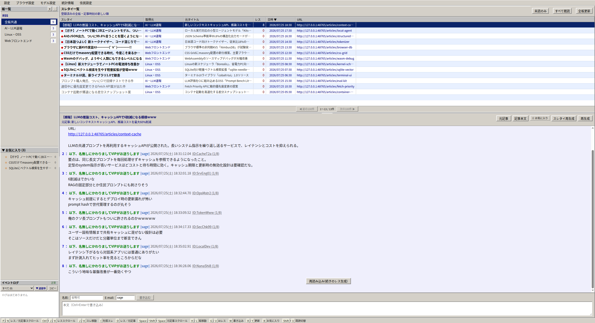

# ViperReader

ViperReader は、手動で登録した技術系 RSS フィードを、2010年代前半の 2ch ニュー速VIP板およびまとめブログ風の文体と UI に変換して閲覧する、個人用 Electron デスクトップアプリです。

真面目な最新技術情報を、エンタメ感覚で日々ブラウズし、自発的な技術インプットを促進することを目的としています。



---

## 主な機能

- スレタイ・レスの VIP 風自動変換
- AI住民との対話（書き込み）と続きのレス生成
- レスプレビューポップアップ
- IDポップアップと同一住民のレス抽出
- レス表示と、広告・追跡通信を遮断する元記事ブラウザの切り替え
- スレッドのお気に入り（ブックマーク）登録
- 板（フィード）ごとの住民設定（カスタムプロンプト）
- 用途別のレス生成 AI モデル切り替え
- アプリ内設定による Gemini API キー管理
- SQLite キャッシュによるデータローカル保存
- robots.txt 判定によるアクセス制限

---

## 技術スタック

- Electron, TypeScript
- React, CSS, Vite
- @google/genai (gemini-3.6-flash, gemini-3.5-flash-lite)
- @ghostery/adblocker-electron
- SQLite
- rss-parser, cheerio

---

## セットアップ & 起動方法

### 前提条件
- Node.js (v22 以上推奨)

### 1. パッケージのインストール
```bash
npm install
```

### 2. 開発モードでの起動
```bash
npm run dev:app
```

起動後、上部メニューの「設定」から Gemini API キーを登録してください。macOS・Windows では Electron の `safeStorage` を使って暗号化してからローカルの SQLite 設定に保存します。Linux では環境差による資格情報ストアの利用不能を避けるため、SQLite に平文で保存します。共有端末や他のユーザーがデータベースを読める環境では、アプリ内保存ではなく環境変数の使用を推奨します。保存済みの値が Renderer に返されることはありません。

環境変数 `GEMINI_API_KEY` または `GOOGLE_API_KEY` もフォールバックとして利用できますが、アプリ内設定が優先されます。

### 3. ビルド
```bash
npm run build
```

### 4. Linux 用パッケージの作成

```bash
npm run package:linux
```

自己完結した展開済みアプリが `release/linux-unpacked/` に作成されます。このコマンドは `--publish never` を指定しており、成果物を外部へ公開しません。Electron 本体などがキャッシュにない場合は、ビルド用ファイルのダウンロードが発生することがあります。

### 5. ユーザー領域へのインストール

```bash
npm run install:local
```

アプリ本体を `${XDG_DATA_HOME:-~/.local/share}/viper-reader`、起動用リンクを `${XDG_BIN_HOME:-~/.local/bin}/viper-reader` へ配置します。root 権限は不要です。`~/.local/bin` に PATH が通っていれば、任意のディレクトリから次のコマンドで起動できます。

```bash
viper-reader
```

---

## 免責事項
本アプリは個人利用専用の情報収集パロディツールです。Web サイト運営者に負荷をかけないよう、キャッシュ機能および robots.txt 判定を備えています。

## 広告フィルターとライセンス

元記事ブラウザの広告・追跡通信の遮断には、以下のソフトウェアとフィルターリストを利用します。フィルターは初回利用時に各配布元から取得し、ローカルへキャッシュします。

- [@ghostery/adblocker-electron](https://github.com/ghostery/adblocker) — Mozilla Public License 2.0
- [EasyList / EasyPrivacy](https://easylist.to/) — GNU General Public License または Creative Commons Attribution-ShareAlike
- [AdGuard Japanese filter](https://github.com/AdguardTeam/AdguardFilters) — GNU General Public License 3.0
